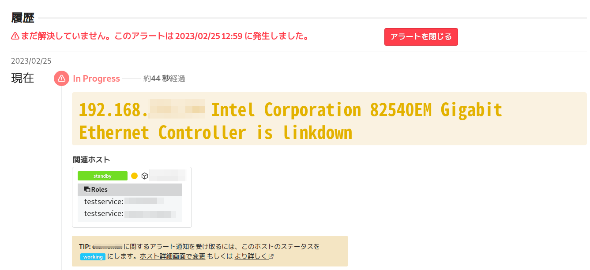

# sabatrapd


## 概要

**sabatrapd**は、ネットワーク機器からSNMP Trapを受け取り、監視サービス[Mackerel](https://ja.mackerel.io/)のチェック監視項目として投稿するミドルウェアです。

SNMP Trapとは、ネットワーク機器側からサーバーに状態の変化を報告するpush型の仕組みです。緊急性の高い異常な状態（リンクダウンやオーバーヒートなど）を素早く報告するために使われます。

（MackerelのSNMP対応としては[mackerel-plugin-snmp](https://mackerel.io/ja/docs/entry/plugins/mackerel-plugin-snmp)がありますが、これはネットワーク機器から定期的に情報を取得するpull型のものです。）

## 制約

- 本プログラムは無保証です。
- プロトコルはSNMP v2cのみに対応しています。
- SNMP Trapの内容はMackerelに投稿され、アラートになります。SNMP Trapの原因が解消されてもsabatrapdでは関知できないので、Mackerel上でアラートを手動で閉じる必要があります。そのため、SNMP Trapの捕捉は最小限に留めることを推奨します。
  - 捕捉対象に対してあらかじめ「WARNING」「CRITICAL」「UNKNOWN」のそれぞれのステータスを設定することができます。無指定時には「WARNING」が用いられます。

## セットアップ手順（リリースアーカイブの利用）

sabatrapdのリリースアーカイブを使うと、プログラミング環境を用意することなく、すぐに試すことができます。

### ダウンロードと展開

[リリースページ](https://github.com/mackerelio-labs/sabatrapd/releases)から、インストール対象のアーキテクチャ（amd64またはarm64）に合ったtar.gz形式のアーカイブファイルをダウンロードします。

適当なフォルダーを用意し、`tar`コマンドで展開してください。例として、新規に`sabatrapd-dist`フォルダーを作り、ダウンロードフォルダーにあるファイルをそこに展開する場合の操作を以下に示します。

```
$ mkdir sabatrapd-dist
$ cd sabatrapd-dist
$ tar xvf ~/Downloads/sabatrapd_linux_amd64.tar.gz
sabatrapd.yml.sample
systemd/sabatrapd.env
 ...
```

### Mackerelの準備

Mackerel側では、以下の作業をしておいてください。

1. 投稿先のMackerelのオーガニゼーションに、チェック監視の投稿先となるスタンダードホストを用意します。
2. MackerelのオーガニゼーションからAPI（書き込み権限）を払い出します。

### sabatrapd.ymlの作成

sabatrapdの設定はYAML形式のファイルで行います。

`sabatrapd.yml.sample`ファイルを`sabatrapd.yaml`という名前にコピーしてください。

`sabatrapd.yml`ファイルをエディターで開き、MackerelオーガニゼーションのAPI文字列とホストIDを記述します。

```
mackerel:
  x-api-key: API文字列
  host-id: ホストID
```

次に、snmptrapdがサービスとして監視するIPアドレス、ポート番号、それにSNMPコミュニティ名を指定します。

```
snmp:
  addr: 0.0.0.0
  port: 9162
  community: public
```

- 上記の設定では、IPv4アドレスで到達可能な範囲からのアクセスを受け付け（`0.0.0.0`）、ポート番号は9162（UDP）を使用、SNMPコミュニティは「public」としています。
- SNMP Trapを送る機器上で送信先ポートを指定できないときには、sabatrapd側の監視ポート番号を標準ポートである「162」にします。ただし、このポートで動作させるには管理者権限で実行する必要があります。
- SNMPコミュニティの名前はSNMP Trapを送る機器に合わせます。コミュニティの異なるSNMP Trapは無視されます。
- SNMPコミュニティ設定は1つのみ指定できます。複数のSNMPコミュニティで運用しなければならないときには、`community`行を削除して、コミュニティの名前照合をスキップするようにしてください。

### 実行

`sabatrapd.yml`を保存したら、いよいよsabatrapdを起動します（Ctrl+cキーを押せば終了します）。

```
./sabatrapd
```

ネットワーク機器からSNMP Trap（たとえばイーサーネットケーブルの抜き差し）をsnmptrapdに送ってみると、捕捉対象のものだったときにはMackerelに投稿され、Mackerelからすぐにアラートが発報されます。



`sabatrapd.yml`に`log-level: debug`や`log-level: info`を設定すると、受け取ったSNMP Trapメッセージや詳細なログが出力されます。SNMP Trapメッセージをうまく処理できないときにご利用ください。

sabatrapdはいくつかのオプションをとることができます。

- `-conf <設定ファイル>`: 設定YAMLファイルを指定します。このオプションを省略したときには、デフォルトでカレントフォルダーにある`sabatrapd.yml`を参照します。
- `-dry-run`: Mackerelにメッセージを投稿しないモードで動作します。Mackerelでの本番の監視の前に、SNMP Trapの挙動を確認したいときに指定します。

### インストール

Linuxのsystemd環境で自動起動させるためのファイルを用意しています。

正常に稼働する`sabatrapd.yml`を用意できたら、インストーラーの`install.sh`を管理者権限で実行してください。

```
$ sudo ./install.sh
sabatrapd installation is finished.
/usr/local/etc/sabatrapd.yml will be used.
To check sabatrapd's status, type 'journalctl -u sabatrapd'
```

デフォルトでは`/usr/local/bin`フォルダーに`sabatrapd`実行ファイルが、`/usr/local/etc`フォルダーに設定ファイルが、systemd設定フォルダーに`sabatrapd.service`がコピーされます。

実行ファイルと設定ファイルのインストール先フォルダーを変えたいときには、環境変数`DESTBINDIR`および`DESTETCDIR`でそれぞれフォルダーを指定してから、`sudo -E ./install.sh`としてください。

状態やログについては`journalctl -u sabatrapd`で確認できます。

## 詳細設定

sabatrapdのより高度な設定およびカスタマイズについて説明します。

### MIBの用意

MIB（Management Information Base）ファイルをsabatrapdに登録すると、SNMP Trapメッセージの項目を抽出して投稿内容に含めることができます。

デフォルトの設定は以下のとおりです。

```
mib:
  directory:
    - "/usr/share/snmp/mibs/"
  modules:
    - SNMPv2-MIB
    - IF-MIB
```

`directory`にMIBファイルを格納するフォルダーを指定し、`modules`に読み込むMIBファイル名を列挙します。子フォルダーは探索しないので、MIBファイルは`directory`のフォルダーの直下に置いてください。

MIBファイルはベンダー各社から提供されています。

- Red Hat Enterprise Linuxやその派生ディストリビューションの場合は、net-snmp-libsパッケージをインストールすると、`/usr/share/snmp/mibs/`フォルダーに`SNMPv2-MIB`や`IF-MIB`などのMIBファイルが置かれます。
- Debian GNU/Linux・Ubuntuの場合は、snmp-mibs-downloaderパッケージ（non-freeセクション）をインストールすると、`/var/lib/snmp/mibs/ietf/`フォルダーに`SNMPv2-MIB`や`IF-MIB`などのMIBファイルが置かれます。

### SNMP Trap捕捉メッセージの設定

SNMP Trapは内容に応じて「`.1.3.6.1.6.3.1.1.5.1`」のような固有のOID（Object Identifier）を持ちます。ベンダーごとに独自のものが用意されており、共通のものは最低限です。

デフォルトで記載済みの設定は以下のとおりです。

```
trap:
  - ident: .1.3.6.1.6.3.1.1.5.1
    format: '{{ addr }} is cold started'
  - ident: .1.3.6.1.6.3.1.1.5.2
    format: '{{ addr }} is warm started'
  - ident: .1.3.6.1.6.3.1.1.5.3
    format: '{{ addr }} {{ read "IF-MIB::ifDescr" }} is linkdown'
  - ident: .1.3.6.1.6.3.1.1.5.4
    format: '{{ addr }} {{ read "IF-MIB::ifDescr" }} is linkup'
```

`ident`に捕捉したいSNMP TrapのOID、`format`にMackerelへ投稿するメッセージというペアで記述します。`format`内では以下の2つのプレースホルダーを指定できます。

- `{{ addr }}`: SNMP Trap元のIPアドレスに展開されます。
- `{{ read "MIBモジュール名::MIBオブジェクト名" }}`: 読み込み済みのMIBファイル内に記載されているモジュール名およびオブジェクト名に基づき、SNMP Trap内の対応する情報を展開します。

上記の設定の場合、MIBモジュール名`IF-MIB`（`IF-MIB`ファイル）のオブジェクト名`ifDescr`（インターフェイスの説明）に相当する値をSNMP Trapから探します。これはたとえば「Intel Corporation 82540EM Gigabit Ethernet Controller」のようになります。インターフェイス番号を示したければ、`IF-MIB::ifIndex`を使います。

どのようなMIBオブジェクトが利用可能かは、各MIBファイルを参照してください。

SNMP Trapを捕捉しすぎると、無用なアラートがMackerelで多発することになります。緊急性の高い、最小限のもののみ設定するようにすることをお勧めします。

`samples`フォルダーには、例としてYAMAHA SWX2220およびSWX3220が発行するSNMP Trapの一覧を用意しています。捕捉したいものを`sabatrapd.yml`にコピーするとよいでしょう。

デフォルトでは捕捉対象のアラートのレベルは「WARNING」に設定されていますが、`alert-level`を使って特定の捕捉対象について明示的に「CRITICAL」や「UNKNOWN」のレベルを設定することも可能です。

```
  - ident: .1.3.6.1.6.3.1.1.5.3
    format: '{{ addr }} {{ read "IF-MIB::ifDescr" }} is linkdown'
    alert-level: critical
```

### ネットワーク機器ごとの文字エンコーディング設定

一部のネットワーク機器では、Shift JISエンコーディングの日本語メッセージを発行することがあります。Mackerelに投稿する際にはUTF-8エンコーディングでなければならないため、ネットワーク機器のIPアドレスを明示して文字エンコーディング変換対象とするようにします。

たとえばIPアドレス「192.168.1.200」のネットワーク機器からのShift JISエンコーディングのメッセージを変換対象とするには、以下のように記載します。

```
encoding:
  - addr: 192.168.1.200
    charset: shift-jis
```

### プロキシーの設定

インターネットに接続するのにプロキシーサーバーを利用している場合は、環境変数`HTTPS_PROXY`にプロキシーサーバーを設定してからsabatrapdを実行してください。

```
export HTTPS_PROXY=https://proxyserver:8443
```

sabatrapdをsystemd環境で自動起動している場合は、`/usr/local/etc/sabatrapd.env`に環境変数を設定する行があるので、そこで指定します。

### ログレベルの設定

`log-level`で標準出力ログに書き出すレベルを設定できます。レベルをdebugにする設定の例を以下に示します。

```
log-level: debug
```

レベルの値に指定できる値は次のとおりです。

- `error`: エラー以外は出力しません。なお、エラーはsabatrapdの動作を継続できないことを意味するレベルなので、エラーメッセージの出力後、sabatrapdは実行を終了します
- `warn`: 警告とエラーを出力します。警告はsabatrapdの動作自体は継続できるものの、対策をとったほうがよい可能性のあるメッセージで、不正なコミュニティ名、解析できないOID、MIB解析の失敗、デコードの失敗、テンプレートからのメッセージ生成の失敗、Mackerelへの投稿の失敗が挙げられます
- `info`: 警告・エラーのほか、sabatrapdの動作情報や受け取ったTrapの情報を出力します
- `debug`: 警告・エラー・sabatrapdの動作情報や受け取ったTrapの情報のほか、ライブラリからのメッセージも含む詳細なログを出力します

<hr>

## セットアップ手順（GitHubリポジトリの利用）

GitHubリポジトリからビルドする手順を紹介します。

[Goの開発環境](https://go.dev/dl/)をインストールした後、本リポジトリを展開した作業フォルダー内で、以下のコマンドでsabatrapdをビルドします。

```
make
```

次のコマンドでsabatrapdを直接ビルドすることもできます。

```
go build
```

以降の使い方については、「セットアップ手順（リリースアーカイブの利用）」の各項と同じです。

<hr>

## ライセンス

Copyright 2023 yseto and Kenshi Muto

Licensed under the Apache License, Version 2.0 (the "License"); you may not use this file except in compliance with the License. You may obtain a copy of the License at

```
http://www.apache.org/licenses/LICENSE-2.0
```

Unless required by applicable law or agreed to in writing, software distributed under the License is distributed on an "AS IS" BASIS, WITHOUT WARRANTIES OR CONDITIONS OF ANY KIND, either express or implied. See the License for the specific language governing permissions and limitations under the License.

## 使用ライブラリ

- https://github.com/sleepinggenius2/gosmi/
- https://github.com/gosnmp/gosnmp
